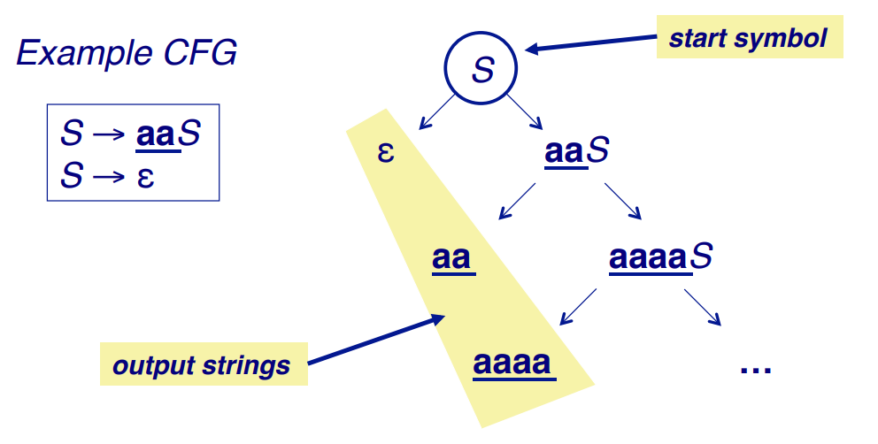
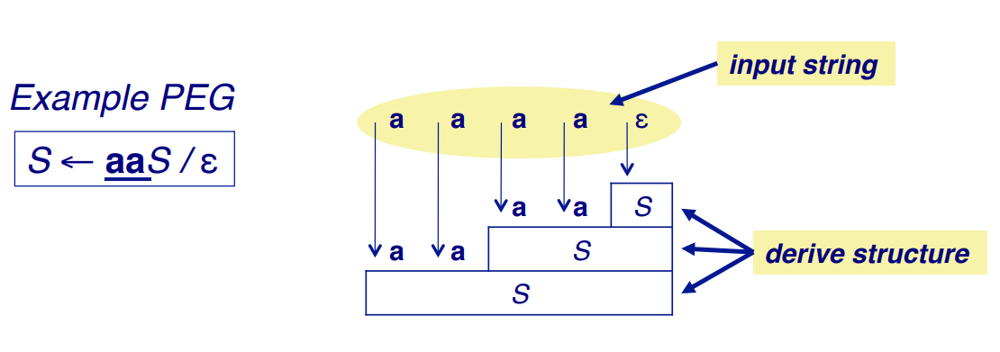

# PEG Parser Combinators Implemented in Rust

This article introduces [pom](https://github.com/J-F-Liu/pom), a PEG parser combinator library implemented in Rust, using operator overloading without macros.

## Why Rust?


After I've learned C/C++ and C#, I found that choosing a new programming language can greatly affect a programmer's productivity.
On one hand I keep sorting out new languages, there are hundreds of them, I examine and choose what I like best, my favorites are C#, Ruby, TypeScript and Rust.
On the other hand I try to design a new language and implement a compiler by myself.

I like the syntax provided by C#, but hate the huge .NET runtime. Dependency on CLR makes distribution of an application written in C# very hard. Compiling to native code is always what I longed for a programming language.
In year 2003 I thought a compiler can get rid of garbage collector by generating free memory instructions in appropriate locations in the target program.
But I didn't go deep into the design of the details of this mechanism, I decided to firstly write a working compiler, then improve the design of the language and implementation of the compiler bit by bit.

The first stage of compilation is parsing. I tried some parser generators, but not satisfied with the result.
Then I dig into the parsing theory, followed several books, implemented DFA, NFA, NFA to DFA conversion, LL(1), LR, LALR algorithms,
then wrote a parser to parse BNF, EBNF or TBNF grammar file, and generate parser code corresponding to the grammar.

The syntax/semantics analysis and code generation parts of a compiler are more difficult.
I even tried to define a intermediate assembly language, at that time I didn't know LLVM. My effort of writing a compiler ceased for years, then Rust was born.

At first glance, the Rust's syntax is a bit strange, why use `fn` instaed of `def`, why use `let mut` instead of `var`, I was not attracted by it.
After read a publication on O'Reilly [*Why Rust?*](http://www.oreilly.com/programming/free/files/why-rust.pdf) I suddenly realized that this is language I'm trying to build,
when you actually start using Rust you'll find that `fn` and `let mut` fits Rust's logic well. For me, **Rust is once a dream now a reality.**

Rust has a steep learning curve, more challenging than any of the previous programming languages I learned. All this learning is worthwhile when you finally get your program working and polished.
Object oriented class hierarchy is not good enough for code reuse, Rust's enum, tuple, struct and trait type system is a better solution.
I still wondering whether the Rust compiler can be smart enough to elide all the lifetime parameters, they are mostly noise and obstacle when reading and writing programs.

## What is PEG?

When I discovered [PEG](http://bford.info/packrat/), I knew that all my previous work on LALR can be thrown away.
I rewrote my parser generator using and working with PEG. Using this parser generator I created a [YAML parser](https://www.codeproject.com/Articles/28720/YAML-Parser-in-C) and a [Lua Interpreter](https://www.codeproject.com/Articles/228212/Lua-Interpreter).

[Parsing Expression Grammars](http://en.wikipedia.org/wiki/Parsing_expression_grammar) (PEGs) are an alternative to [Context-Free Grammars](http://en.wikipedia.org/wiki/Context-free_grammar) (CFGs) for formally specifying syntax.
CFG describe a rule system to generate language strings while PEG describe a rule system to recognize language strings.





Unlike CFGs, PEGs cannot be ambiguous; if a string parses, it has exactly one valid parse tree.
We normally specify our languages directly by how to recognize it, so PEG is both closer match to syntax practices and more powerful than nondeterministic CFG.

### Parsing expressions

| Expr       | Description                         |
| ---------- | ----------------------------------- |
| ε          | the empty string                    |
| a          | terminal (a ∈ Σ)                    |
| A          | non-terminal (A ∈ N)                |
| e1 e2      | sequence                            |
| e1 / e2    | prioritized choice                  |
| e?, e*, e+ | optional, zero-or-more, one-or-more |
| &e, !e     | syntactic predicates                |

## What is parser combinator?

When I heard of Parsec in the Haskell world, I got the concept of parser combinator for my first time.

A *parser* is a function which takes a *string* (a series of *symbols*) as input, and returns matching result as *output*.

A *combinator* is a higher-order function (a "functional") which takes zero or more functions (each of the same type) as input and returns a new function of the same type as output.

A *parser combinator* is a higher-order function which takes parsers as input and returns a new parser as output.

Parser combinators allow you write grammar rules and create a parser directly in the host language, without a separated parser generation step, so the whole procedure is more fluent.

## How to implement parser combinators?

I thought deeply about how to implement parser combinator using language constructs provided by Rust. In summary, there are four approaches:

1. Parser as closure

   ```rust
   pub fn empty<I>() -> impl Fn(&mut Input<I>) -> Result<()> {
     |_: &mut Input<I>| Ok(())
   }

   pub fn term<I>(t: I) -> impl Fn(&mut Input<I>) -> Result<I> {
       ...
   }

   pub fn seq<'a, I>(tag: &'a [I]) -> impl Fn(&mut Input<I>) -> Result<&'a [I]> {
     ...
   }
   ...
   // To create a parser for integer
   let parser = concatenate(optional(one_of("+-")), one_or_more(one_of("0123456789")));
   ```

   *Pros*: Less implementation code.

   *Cons*: Cannot overload operators, poor readability.

2. Parser as struct

   ```rust
   pub struct Parser<I, O> {
       method: Box<Fn(&mut Input<I>) -> Result<O>>,
   }

   impl<I, O> Parser<I, O> {
       /// Create new parser.
       pub fn new<P>(parse: P) -> Parser<I, O>
           where P: Fn(&mut Input<I>) -> Result<O> + 'static
       {
           Parser { method: Box::new(parse) }
       }

       /// Apply the parser to parse input.
       pub fn parse(&self, input: &mut Input<I>) -> Result<O> {
           (self.method)(input)
       }
       ...
   }

   pub fn empty<I>() -> Parser<I, ()> {
       Parser::new(|_: &mut Input<I>| Ok(()))
   }

   pub fn term<I>(t: I) -> Parser<I, I> {
       ...
   }
   ...
   impl<I: Copy, O, U> Add<Parser<I, U>> for Parser<I, O> {
       type Output = Parser<I, (O, U)>;

       fn add(self, other: Parser<I, U>) -> Self::Output
           where I: 'static,
                 O: 'static,
                 U: 'static
       {
           Parser::new(move |input: &mut Input<I>| {
               let start = input.position();
               let result = self.parse(input)
                   .and_then(|out1| other.parse(input).map(|out2| (out1, out2)));
               if result.is_err() {
                   input.jump_to(start);
               }
               result
           })
       }
   }
   ...
   // To create a parser for integer
   let parser = one_of("+-").opt() + one_of("0123456789").repeat(1..);
   ```

   *Pros*: Can overload operators, elegant code.

   *Cons*: Depends on compiler's zero-cost abstractions to optimize runtime performance.

   Crate [pom](https://github.com/J-F-Liu/pom) is using this approach.

3. Parser as trait

   ```rust
   pub trait Parser  {
     type I: ?Sized;
     type O;

     fn parse<'a>(&self, data: &'a Self::I) -> ParseResult<&'a Self::I, Self::O>;
   }

   pub trait ParserCombinator : Parser + Clone {
     fn then<P: Parser<I=Self::I>>(&self, p: P) -> ChainedParser<Self,P> {
       ChainedParser{first: self.clone(), second: p}
     }
     ...
   }

   pub fn opt<T: Parser>(t: T) -> OptionParser<T> {
     OptionParser{parser: t}
   }

   pub fn recursive<I:?Sized,O, F:  Fn() -> Box<Parser<I=I,O=O>>>(f: F) -> RecursiveParser<I,O,F> {
     RecursiveParser{parser: Rc::new(f)}
   }

   ...

   pub struct ChainedParser<A,B> {
     first: A,
     second: B,
   }
   ...
   impl<C: ?Sized, A: Parser<I=C>, B: Parser<I=C>> Parser for ChainedParser<A, B> {
     type I = C;
     type O = (A::O,B::O);

     fn parse<'a>(&self, data: &'a Self::I) -> ParseResult<&'a Self::I, Self::O>{
       match self.first.parse(data) {
         Ok((a, d2)) => match self.second.parse(d2) {
           Ok((b, remain)) => Ok(((a, b), remain)),
           Err(err) => Err(err)
         },
         Err(err) => Err(err)
       }
     }
   }

   impl<C: ?Sized, A: ParserCombinator<I=C>, B: ParserCombinator<I=C>>  Clone for ChainedParser<A, B> {
       ...
   }
   ...
   ```

   *Pros*: Can overload operators.

   *Cons*: Bloated code.

   Crate [peruse](https://github.com/DanSimon/peruse) is using this approach.

4. Parser as macro

   ```rust
   #[macro_export]
   macro_rules! do_parse (
     (__impl $i:expr, $consumed:expr, ( $($rest:expr),* )) => (
       $crate::IResult::Done($i, ( $($rest),* ))
     );

     (__impl $i:expr, $consumed:expr, $e:ident >> $($rest:tt)*) => (
       do_parse!(__impl $i, $consumed, call!($e) >> $($rest)*);
     );
     (__impl $i:expr, $consumed:expr, $submac:ident!( $($args:tt)* ) >> $($rest:tt)*) => (
       {
         match $submac!($i, $($args)*) {
           $crate::IResult::Error(e)      => $crate::IResult::Error(e),
           $crate::IResult::Incomplete($crate::Needed::Unknown) =>
             $crate::IResult::Incomplete($crate::Needed::Unknown),
           $crate::IResult::Incomplete($crate::Needed::Size(i)) =>
             $crate::IResult::Incomplete($crate::Needed::Size($consumed + i)),
           $crate::IResult::Done(i,_)     => {
             do_parse!(__impl i,
               $consumed + ($crate::InputLength::input_len(&($i)) -
                            $crate::InputLength::input_len(&i)), $($rest)*)
           },
         }
       }
     );

     (__impl $i:expr, $consumed:expr, $field:ident : $e:ident >> $($rest:tt)*) => (
       do_parse!(__impl $i, $consumed, $field: call!($e) >> $($rest)*);
     );

     (__impl $i:expr, $consumed:expr, $field:ident : $submac:ident!( $($args:tt)* ) >> $($rest:tt)*) => (
       {
         match  $submac!($i, $($args)*) {
           $crate::IResult::Error(e)      => $crate::IResult::Error(e),
           $crate::IResult::Incomplete($crate::Needed::Unknown) =>
             $crate::IResult::Incomplete($crate::Needed::Unknown),
           $crate::IResult::Incomplete($crate::Needed::Size(i)) =>
             $crate::IResult::Incomplete($crate::Needed::Size($consumed + i)),
           $crate::IResult::Done(i,o)     => {
             let $field = o;
             do_parse!(__impl i,
               $consumed + ($crate::InputLength::input_len(&($i)) -
                            $crate::InputLength::input_len(&i)), $($rest)*)
           },
         }
       }
     );

     // ending the chain
     (__impl $i:expr, $consumed:expr, $e:ident >> ( $($rest:tt)* )) => (
       do_parse!(__impl $i, $consumed, call!($e) >> ( $($rest)* ));
     );

     (__impl $i:expr, $consumed:expr, $submac:ident!( $($args:tt)* ) >> ( $($rest:tt)* )) => (
       match $submac!($i, $($args)*) {
         $crate::IResult::Error(e)      => $crate::IResult::Error(e),
         $crate::IResult::Incomplete($crate::Needed::Unknown) =>
           $crate::IResult::Incomplete($crate::Needed::Unknown),
         $crate::IResult::Incomplete($crate::Needed::Size(i)) =>
           $crate::IResult::Incomplete($crate::Needed::Size($consumed + i)),
         $crate::IResult::Done(i,_)     => {
           $crate::IResult::Done(i, ( $($rest)* ))
         },
       }
     );

     (__impl $i:expr, $consumed:expr, $field:ident : $e:ident >> ( $($rest:tt)* )) => (
       do_parse!(__impl $i, $consumed, $field: call!($e) >> ( $($rest)* ) );
     );

     (__impl $i:expr, $consumed:expr, $field:ident : $submac:ident!( $($args:tt)* ) >> ( $($rest:tt)* )) => (
       match $submac!($i, $($args)*) {
         $crate::IResult::Error(e)      => $crate::IResult::Error(e),
         $crate::IResult::Incomplete($crate::Needed::Unknown) =>
           $crate::IResult::Incomplete($crate::Needed::Unknown),
         $crate::IResult::Incomplete($crate::Needed::Size(i)) =>
           $crate::IResult::Incomplete($crate::Needed::Size($consumed + i)),
         $crate::IResult::Done(i,o)     => {
           let $field = o;
           $crate::IResult::Done(i, ( $($rest)* ))
         },
       }
     );

     ($i:expr, $($rest:tt)*) => (
       {
         do_parse!(__impl $i, 0usize, $($rest)*)
       }
     );
   );
   ...
   // To create a parser for integer
   named!(integer<&[u8], i64>, map!(
     pair!(
       opt!(sign),
       map_res!(map_res!(digit, str::from_utf8), i64::from_str)
     ),
     |(sign, value): (Option<i64>, i64)| { sign.unwrap_or(1) * value }
   ));
   ```

   *Pros*: Can create DSL syntax, high performance.

   *Cons*: Macros themselves are difficult to read, write and debug.

   Crate [nom](https://github.com/Geal/nom) is using this approach.

According to above comparison, parser as struct is the best approach. At first I choose to use nom to create a PDF parser, it turns out a special PDF feature blocked me.
When parsing a PDF stream object, it's length may be a referenced object, hence the need to get the length from a reader.
The `named! ` macro cannot accept extra parameters, there is no obvious way to read a length object inside a stream object parser.
This is the primary reason why I started to develop pom.

## List of predefined parsers and combinators in pom

| Basic Parsers  | Description                              |
| -------------- | ---------------------------------------- |
| empty()        | Always succeeds, consume no input.       |
| end()          | Match end of input.                      |
| sym(t)        | Match a single terminal symbol *t*.       |
| seq(s)         | Match sequence of symbols.               |
| list(p,s)      | Match list of *p*, separated by *s*.     |
| one_of(set)    | Success when current input symbol is one of the set. |
| none_of(set)   | Success when current input symbol is none of the set. |
| is_a(predicate)  | Success when predicate return true on current input symbol. |
| not_a(predicate) | Success when predicate return false on current input symbol. |
| take(n)        | Read *n* symbols.                        |
| skip(n)        | Skip *n* symbols.                        |
| call(pf)       | Call a parser factory, can used to create recursive parsers. |

These are functions to create basic parsers.


| Parser Combinators | Description                              |
| ------------------ | ---------------------------------------- |
| p &#124; q         | Match p or q, return result of the first success. |
| p + q              | Match p and q, if both success return a pair of results. |
| p - q              | Match p and q, if both success return result of p. |
| p * q              | Match p and q, if both success return result of q. |
| p >> q             | Parse p and get result P, then parse and return result of q(P). |
| -p                 | Success when p success, doen't consume input. |
| !p                 | Success when p fail, doen't consume input. |
| p.opt()            | Make parser optional.                    |
| p.repeat(m..n)     | `p.repeat(0..)` repeat p zero or more times<br>`p.repeat(1..)` repeat p one or more times<br>`p.repeat(1..4)` match p at least 1 and at most 3 times |
| p.map(f)           | Convert parser result to desired value.  |
| p.convert(f)       | Convert parser result to desired value, fail in case of conversion error. |
| p.pos()            | Get input position after matching p.     |
| p.collect()        | Collect all matched input symbols.       |
| p.discard()        | Discard parser output.                   |
| p.name(_)          | Give parser a name to identify parsing errors. |

These are operations to create new parsers based on other parsers. The choice of operators is established by their operator precedence, arity and "meaning".

Use `*` to ignore the result of first operand on the start of an expression, `+` and `-` can fulfill the need on the rest of the expression.
For example, `A * B * C - D + E - F` will return the results of C and E as a pair.

## Using the code

There are three ways to create a parser:

1. As a variable, normally used to construct another parser.

   ```rust
   let integer = one_of(b"+-").opt() + one_of(b"0123456789").repeat(1..);
   ```

2. As a closure, when referenced several times in constructing another parser.

   ```rust
   let integer = || one_of(b"+-").opt() + one_of(b"0123456789").repeat(1..);
   let pair = sym(b'(') * integer() - sym(b',') + integer() - sym(b')');
   ```

3. As a function, provides a high level construct.

   ```rust
   fn integer() -> Parser<u8, (Option<u8>, Vec<u8>)> {
       one_of(b"+-").opt() + one_of(b"0123456789").repeat(1..)
   }
   ```

## Example JSON Parser

Let me explain the parser combinators in more detail by creating a JSON parser. Syntax diagrams can be found on [json.org](http://www.json.org/).

```rust
extern crate pom;
use pom::{Parser, DataInput};
use pom::char_class::hex_digit;
use pom::parser::*;

use std::str::FromStr;
use std::char::{decode_utf16, REPLACEMENT_CHARACTER};
use std::collections::HashMap;

#[derive(Debug, PartialEq)]
pub enum JsonValue {
    Null,
    Bool(bool),
    Str(String),
    Num(f64),
    Array(Vec<JsonValue>),
    Object(HashMap<String,JsonValue>)
}
```

Import predefined parser combinators and utility functions, define the JSON parser's output value as an enum.

```rust
fn space() -> Parser<u8, ()> {
    one_of(b" \t\r\n").repeat(0..).discard()
}
```

Match zero or more space characters, the output is ignored.

```rust
fn number() -> Parser<u8, f64> {
    let integer = one_of(b"123456789") - one_of(b"0123456789").repeat(0..) | sym(b'0');
    let frac = sym(b'.') + one_of(b"0123456789").repeat(1..);
    let exp = one_of(b"eE") + one_of(b"+-").opt() + one_of(b"0123456789").repeat(1..);
    let number = sym(b'-').opt() + integer + frac.opt() + exp.opt();
    number.collect().convert(String::from_utf8).convert(|s|f64::from_str(&s))
}
```

Don't care each output of integer, frac or exp, collect() method get all the match character as a Vec<u8>, then it is converted to a string, and further converted to a float number.

```rust
fn string() -> Parser<u8, String> {
    let special_char = sym(b'\\') | sym(b'/') | sym(b'"')
        | sym(b'b').map(|_|b'\x08') | sym(b'f').map(|_|b'\x0C')
        | sym(b'n').map(|_|b'\n') | sym(b'r').map(|_|b'\r') | sym(b't').map(|_|b'\t');
    let escape_sequence = sym(b'\\') * special_char;
    let char_string = (none_of(b"\\\"") | escape_sequence).repeat(1..).convert(String::from_utf8);
    let utf16_char = seq(b"\\u") * is_a(hex_digit).repeat(4).convert(String::from_utf8).convert(|digits|u16::from_str_radix(&digits, 16));
    let utf16_string = utf16_char.repeat(1..).map(|chars|decode_utf16(chars).map(|r| r.unwrap_or(REPLACEMENT_CHARACTER)).collect::<String>());
    let string = sym(b'"') * (char_string | utf16_string).repeat(0..) - sym(b'"');
    string.map(|strings|strings.concat())
}
```

The bulk of code is written to parse escape sequences.
According to [Wikipedia](https://en.wikipedia.org/wiki/JSON#Data_portability_issues), UTF-16 surrogate pairs is a detail missed by some JSON parsers.
We implement this easily with Rust's Unicode support.

```rust
fn array() -> Parser<u8, Vec<JsonValue>> {
    let elems = list(call(value), sym(b',') * space());
    sym(b'[') * space() * elems - sym(b']')
}

fn object() -> Parser<u8, HashMap<String, JsonValue>> {
    let member = string() - space() - sym(b':') - space() + call(value);
    let members = list(member, sym(b',') * space());
    let obj = sym(b'{') * space() * members - sym(b'}');
    obj.map(|members|members.into_iter().collect::<HashMap<_,_>>())
}

fn value() -> Parser<u8, JsonValue> {
    ( seq(b"null").map(|_|JsonValue::Null)
    | seq(b"true").map(|_|JsonValue::Bool(true))
    | seq(b"false").map(|_|JsonValue::Bool(false))
    | number().map(|num|JsonValue::Num(num))
    | string().map(|text|JsonValue::Str(text))
    | array().map(|arr|JsonValue::Array(arr))
    | object().map(|obj|JsonValue::Object(obj))
    ) - space()
}
```

array and object are very straight to parse, notice `call(value)`, at the first attempt I write it as `value()`, then an infinite loop is created. Recursive parsing is solved by adding `call()` to `pom`.

```rust
pub fn json() -> Parser<u8, JsonValue> {
    space() * value() - end()
}
```

The final JSON parser, declared as public. According to [RFC 7159](https://tools.ietf.org/html/rfc7159) a JSON text is a serialized value of any of the six types.
`end()` is used to ensure there is no extra text in the input.

```rust
fn main() {
    let test = br#"
    {
        "Image": {
            "Width":  800,
            "Height": 600,
            "Title":  "View from 15th Floor",
            "Thumbnail": {
                "Url":    "http://www.example.com/image/481989943",
                "Height": 125,
                "Width":  100
            },
            "Animated" : false,
            "IDs": [116, 943, 234, 38793]
        },
        "escaped characters": "\u2192\uD83D\uDE00\"\t\uD834\uDD1E"
    }"#;

    let mut input = DataInput::new(test);
    println!("{:?}", json().parse(&mut input));
}
```

Use the JSON parser to parse JSON text, the output is:

```
cargo run --example json
   Compiling pom v0.6.0 (file:///work/pom)
    Finished debug [unoptimized + debuginfo] target(s) in 2.20 secs
     Running `target/debug/examples/json`
Ok(Object({"Image": Object({"Width": Num(800), "Title": Str("View from 15th Floor"), "Height": Num(600), "Animated": Bool(false), "IDs": Array([Num(116), Num(943), Num(234), Num(38793)]), "Thumbnail": Object({"Height
": Num(125), "Url": Str("http://www.example.com/image/481989943"), "Width": Num(100)})}), "escaped characters": Str("→😀\"\t𝄞")}))
```

The above parser assumes that the input bytes is UTF-8 encoded text; otherwise, you can use the [char version of JSON parser](https://github.com/J-F-Liu/pom/blob/master/examples/json_char.rs).

`p >> q` is not covered in the JSON example. It is used to pass the output of `p` into parser creation of `p`.

```rust
let mut input = DataInput::new(b"5oooooooo");
let parser = one_of(b"0123456789").map(|c|c - b'0') >> |n| {
    take(n as usize) + sym(b'o').repeat(0..)
};
let output = parser.parse(&mut input);
assert_eq!(output, Ok( (vec![b'o';5], vec![b'o';3]) ));
```

The first character indicates the number of `o`s to parse, then the number is used in the closure `|n| take(n)`.

## More examples

- A [simple PDF parser](https://github.com/J-F-Liu/lopdf/blob/491dece5867a2b81878208bcb5e07ff1007c0d89/src/parser.rs), you can compare it with the equivalent [nom version](https://github.com/J-F-Liu/lopdf/blob/dff82c49fea9ac9ea23edf42ad80e480bd5edb46/src/parser.rs).
- A [complete PDF parser](https://github.com/J-F-Liu/lopdf/blob/master/src/parser.rs) which can read length object when parsing stream object.

## Conclusion

I think I created something really cool, you can use pom to write all kinds of parsers elegantly.
I helped pom to evolve version by version into what it is, and pom also helps me to grow my Rust programming skills a lot.
Of course there is still room for improvement, any feed back is welcome.

## Points of interest

I try to add a `cache()` method to `Parser`. Memorize the result on given input position, return the result directly when called again, effectively implementing the Packrat Parsing algorithm.
But there are two problems, 1) save result means mutate a Hashmap, so Parser's method field should be a Box of `FnMut`,
2) Hashmap returns an reference of value for a given key, the value cannot be moved, so need to make the value cloneable.

## Pain points where Rust needs to improve

1. Implement trait for `[T]` should automatically implement `[T; N]`.
2. The standard library should provide a char_at() method return the char and the number of bytes consumed, like:
	```rust
	pub trait Encoding {
		/// Get char at a byte index, return the char and the number of bytes read.
		fn char_at(&self, data: &[u8], index: usize) -> Result<(char, u32)>;
	}
	```
3. Can ellide 'static lifetime parameter, allow `Parser<'static, I, O>` written as `Parser<I, O>`.
4. Should `impl Copy for closure`, so that FnOnce closure can be passed to map() inside Fn closure.
	```rust
	pub fn map<U, F>(self, f: F) -> Parser<'a, I, U>
		where F: FnOnce(O) -> U + Copy + 'a,
			  I: 'static,
			  O: 'static,
			  U: 'static
	{
		Parser::new(move |input: &mut Input<I>| {
			self.parse(input).map(f)
		})
	}
	```

## More Readings

- [The Rust programming language, in the words of its practitioners](https://brson.github.io/fireflowers/)
- [PEGs, Packrats and Parser Combinators](http://scg.unibe.ch/download/lectures/cc2011/10PEGs.pptx.pdf)
- [An introduction to parsing text in Haskell with Parsec](http://unbui.lt/#!/post/haskell-parsec-basics/)
